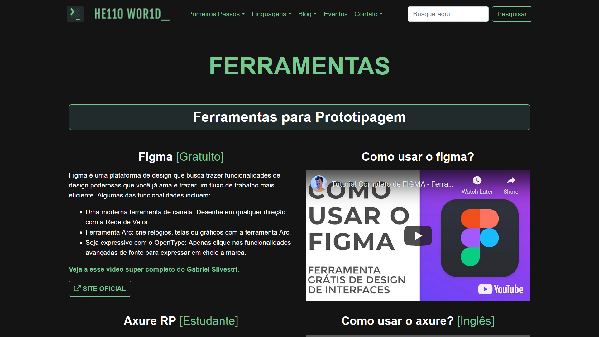

# Programação de Funcionalidades

Implementação do sistema descritas por meio dos requisitos funcionais e/ou não funcionais. Deve relacionar os requisitos atendidos os artefatos criados (código fonte) além das estruturas de dados utilizadas e as instruções para acesso e verificação da implementação que deve estar funcional no ambiente de hospedagem.

Para cada requisito funcional, pode ser entregue um artefato desse tipo

## Guia do Git

### Requisitos:

- RF-001 - Disponibilizaruma página com os primeiros passos para um programador

Ao clicar na opção `Primeiros Passos/Guia do Git` na `nav-bar` o usuário será levado à página abaixo, ela faz parte das páginas desenvolvidas para atender ao RF-001.

 <br/>

A página contém conteúdo relevante para informar o usuário sobre o git, chaves ssh e como usar seu terminal num fluxo de trabalho diário.

Dentro da seção `Chaves SSH`, possui uma coluna com 2 bõtoes que redirecionam o usuário para a documentação do github sobre as chaves e como gerá-las e vincular elas a sua conta.

Ela também conta com uma playlist de vídeos do Willian Justen [@willianjusten](https://github.com/willianjusten) ensinando passo a passo como usar o git.

 <br/>

## Ferramentas

### Requisitos:

- RF-005 - Disponibilizar uma página com dicas e ferramentas

A página `Ferramentas` agrega um conteúdo popular entre desenvolvedores para as seguintes funcionalidades:
- Prototipagem
- API e Telemtria
- Planejamento

Ela possui um formato de fácil consumo, estruturando o conteúdo em pequenas **seções de conteúdo** com texto e vídeo sobre a ferramenta.

Cada **seção de conteúdo** possui o **título da ferramenta** e uma breve descrição ou introdução, uma breve recomendação em negrito e **botões de redirecionamento** do usuário, seja para a `Página da Ferramenta`, `Documentação` ou `Download` se disponível, como mostrado nas imagens abaixo.

 <br/>

Exemplo de uma ferramenta com botão de `Download`.

 <br />

## Editores de Código

### Requisitos:

- RF-005 - Disponibilizar uma página com dicas e ferramentas

A página `Guia de IDE` segue o formato da página `Ferramentas`, com seções de conteúdo e botões de redirecionamento.

Nela está um breve comparativo entre IDEs e Editores de Código, um redirecionamento para um artigo na Alura explicando mais a fundo e um vídeo comparando `Sublime`, `Atom` e `VSCode`.

*n.b. - Atom será arquivado pelo Github em Dezembro de 2022*

 <br/>

## Pagina Eventos

### Requisitos:

- RF-006 - Disponibilizar uma página com eventos de programação.

Para atender ao requisito RF-006 foi criada a pagina `EVENTOS`.

Ao acessar acessar a pagina eventos, o usuário visualizará a lista de todos os eventos de 2022 disponíveis no site. 

Para essa pagina foram desenvolvidos: 

JSON: Um arquivo JSON `src/db-eventos.json` contendo um array com todos os eventos (objetos) e suas informações que serão carregados dinamicamente no site; 

 <br/>

Filtro de eventos: Foi desenvolvido um filtro do tipo `form-select` onde o usuário pode selecionar as opções de visualizar todos os eventos, apenas os eventos online ou apenas os eventos presenciais.

 <br/>

O filtro apresentado acima conta com uma função implementada no arquivo `src/js/eventos.lista` que percorre a lista completa de eventos traduzida para JSON e trazida para esse arquivo pela api `FETCH` buscando a categoria desejada e trazendo para ser carregada na pagina uma nova lista filtrada com o resultado encontrado.

Campo para ordenação dos eventos: Foi desenvolvido também, um `campo ordenação` do tipo `form-select` para que, ao clicar nesse botão, o usuário possa ordenar os eventos disponíveis do primeiro do ano para o ultimo e vice-versa.

 <br/>

O campo ordenação também conta com uma função implementada no arquivo `src/js/eventos.lista` que acessa a lista completa dos eventos, reorganizando-os da forma desejada e trazendo o resultado para o usuário.

Lista Eventos: A `lista de eventos` do site é exibida através de blocos `HTML` que são criados dinamicamente por uma função implementada no arquivo `src/js/eventos-lista.js`. Essa função percorre todos os eventos da lista `JSON` e a partir de cada objeto encontrado ele cria um novo HTML e carrega essa lista de blocos HTML na pagina do site.

 <br/>

Cada `bloco` de evento (foto pequena do evento, titulo, tipo e data) foi desenvolvido dentro de uma tag `<a>` que ao ser clicada, encaminha o usuário para a pagina DETALHES `src/js/eventos.detalhes`. Essa pagina abre apenas o HTML do evento selecionado, mostrando mais informações sobre o mesmo.

Pagina detalhes: Ao abrir a pagina `detalhes`, será exibida a foto grande do evento, sua descrição e área "deseja participar?" onde foi disponibilizado `link` dentro de uma tag `<a>` que é carregado dinamicamente de acordo com a `URL` descriminada nas informações de cada evento no arquivo JSON `src/db-eventos.json`. Essa URL abre uma nova aba e encaminha o usuário diretamente para o site oficial do evento para se inscrever. 

 <br/>

## Ajuda/Suporte

### Requisitos:

- RF-007 - Disponibilizar uma página para obter suporte sobre o sistema

A página `Ajuda` permite que o usuário envie uma mensagem de contato para a equipe de desenvolvimento através de um formulário simples feito em `HTML` e usando a API do `EmailJS` para realizar os envios seguindo um template que a ferramenta mesmo proporciona.

No `src/help.html` no final tem um snippet para dar entrada a API key pública usando a função `emailjs.init('< --PublicKey-- >');` sendo `--PublicKey--` onde irá usar sua chave pública.

 <br/>

### Código HTML e JavaScript

Para realizar o envio, é necessário usar um snippet do EmailJS com os dados necessários.

Para isso, foi usado um javascript básico que puxa os dados inseridos no formulário e aciona um gatilho quando o botão de enviar é clicado.

É necessário usar o CDN do EmailJS no HTML
```
<head>
...
  <!-- CDN EmailJS -->
  <script
        type="text/javascript"
        src="https://cdn.jsdelivr.net/npm/@emailjs/browser@3/dist/email.min.js">
  </script>
  <script type="text/javascript">
    (function () {
      emailjs.init('< --PublicKey-- >');
    })();
  </script>
</head>
```
Abaixo segue o código js usado para enviar os dados. Veja a [documentação](https://www.emailjs.com/docs/) do EmailJS.
```
// criando as vars q vão receber os dados do formulario html e botao de envio
const btn = document.getElementById('enviar');
const form = document.getElementById('form');

// gatilho para o botão e nele acionamos a função de envio de formulario do EmailJS
btn.addEventListener('click', function (e){
    e.preventDefault();

    // servico registrado, nesse caso o email do projeto
    const serviceID = " --ServiceID-- ";
    
    // template criado no serviço, veja na imagem abaixo o exemplo
    const templateID = " --TemplateID-- ";
    
    // chave publica da api
    const publicKEY = " --PublicKey-- ";

    // função sendForm com entrada dos dados da var 'form' declarada acima
    emailjs.sendForm(serviceID,templateID, form, publicKEY)
        .then((res) => {
            // se tudo der certo, a página faz um alert
            alert('Mensagem enviada!');
        }, (error) => {
            // no caso de erros, checar o console
            console.log('FAILED...', error.text);
        });
});
```
Observe que no código `HTML` os itens do formulário possuem a mesma definição que o template.
Sendo o item Nome contendo `name = nome` dentro da tag `<input type="text" name="nome">`.

Apesar de na imagem abaixo, apresentar os endereços emailDestino e emailFonte como exemplo, é possível e recomendado que se use o mesmo endereço.


> **Links Úteis**:
>
> - [Trabalhando com HTML5 Local Storage e JSON](https://www.devmedia.com.br/trabalhando-com-html5-local-storage-e-json/29045)
> - [JSON Tutorial](https://www.w3resource.com/JSON)
> - [JSON Data Set Sample](https://opensource.adobe.com/Spry/samples/data_region/JSONDataSetSample.html)
> - [JSON - Introduction (W3Schools)](https://www.w3schools.com/js/js_json_intro.asp)
> - [JSON Tutorial (TutorialsPoint)](https://www.tutorialspoint.com/json/index.htm)
