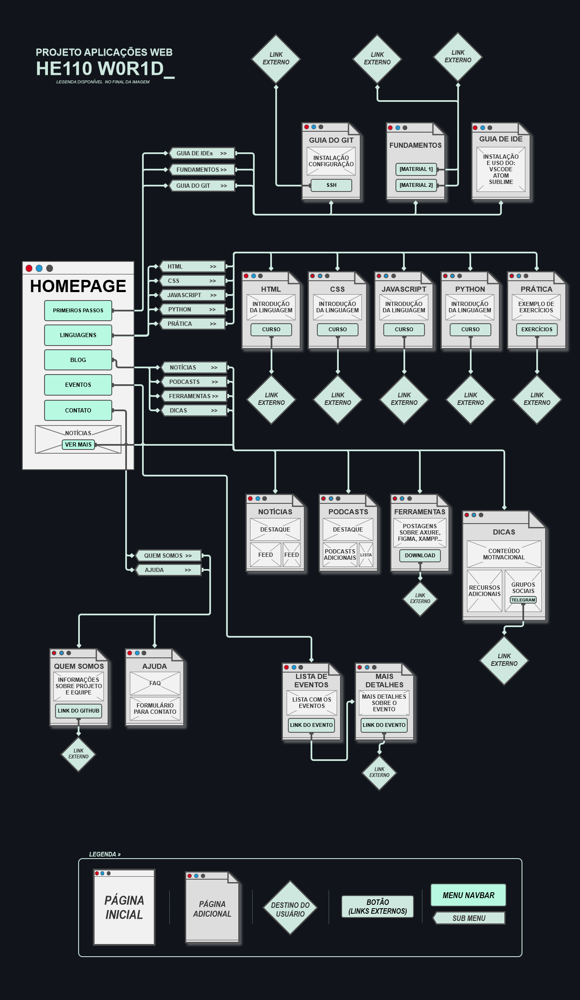
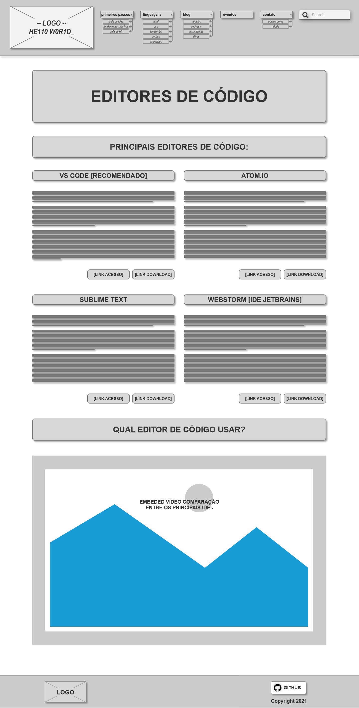
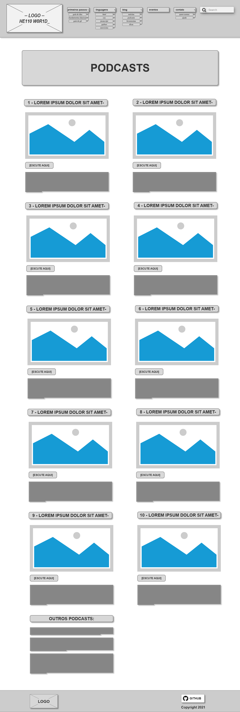

# Projeto de Interface

O projeto está dividido em 5 menus principais: Primeiros Passos, Linguagens, Blog, Eventos e Contato seguido de seus sub-menus. As informações foram organizadas para proporcionar um acesso simples e direto, com o foco na usabilidade e facilidade de navegação. O usuário pode fazer uso da barra de navegação em todas as páginas para retornar a página inicial ou acessar o conteúdo disponível pelo menu.

## User Flow

## Wireframes

### Homepage

[homepade-wireframe](img//homepage-wireframe.png) Esta é a homepage do wireframe.

### Primeiros Passos: Guia de IDEs

Ao clicar no botão "Primeiros Passos" na página inicial, o usuário poderá selecionar entre 3 opções sendo "Guia de IDEs" um deles, que apresentará para o usuário a página abaixo com os principais editores de código disponíveis, tal como uma menção bônus do WebStorm (IDE dedicado para Frontend feito pela JetBrains - o qual possui uma licença anual para estudantes). No final da página o usuário encontra um vídeo externo comparando os editores mencionados.

### Primeiros Passos: Fundamentos para aprender a programar

Ao clicar no botão "Primeiros Passos" na página inicial, o usuário poderá selecionar a opção "Fundamentos para aprender a programar" que irá navegá-lo para a página abaixo, nela o usuário encontra informações sobre fundamentos desejáveis para uma pessoa que deseja se um programar. Com explicações sobre a importância dos fundamentos matemáticos, assim como fontes externas de como se atualizar sobre. Além de uma área voltada para lógica de programação, acompanhada por um exemplo de código simples, com seu pseudocódigo e por fim um fluxograma representando seu funcionamento, mostrando assim para o usuário algumas das diferentes representações de uma lógica, além do código propriamente dito.

### Primeiros Passos: Guia do Git

Ao clicar no botão "Primeiros Passos" na página inicial, o usuário poderá selecionar a opção "Guia do Git" que irá navegá-lo para a página abaixo, nela o usuário encontra informações sobre a utilidade e instalação do git. Chaves SSH e links para a documentação no github ensinando o necessário e um vídeo sobre o mesmo assunto. Por fim um vídeo para personalização do perfil do github como bônus e os principais comandos utilizados no fluxo de trabalho com git.

### Linguagens: HTML

%DESCRIÇÃO%

### Linguagens: CSS

%DESCRIÇÃO%

### Linguagens: JavaScript

%DESCRIÇÃO%

### Linguagens: Exercícios

Ao clicar no botão "Prática" na página inicial, o usuário será direcionado para a página de exercícios. Na página ele encontrará os exercícios separados por linguagens e com links externos que o permitirão colocar em ação aquilo que foi aprendido. Os links levarão o usuário a exercícios para inicantes e também à plataformas que permitirão ao ulitizador salvar seu progresso e ver seu desenvolvimento na linguagem de sua preferência.

### Blog: Notícias

%DESCRIÇÃO%

### Blog: Podcasts

Ao clicar no botão "Blog" na página inicial, o usuário poderá selecionar a opção "Podcasts" que irá navegá-lo para a página abaixo, nela o usuário encontrará podcasts com informações sobre tecnologia, sobre o dia a dia de pessoas que trabalham na área da tecnologia e  dicas e notícias para se manterem atualizados.A página contará com diversos podcasts, onde serão destacados os dez mais interessantes, fazendo-se um breve descrição dos assuntos abordados em cada podcasts, e os demais, não menos interessantes, virão com seu link ao final da página.     

### Blog: Ferramentas para Desenvolvedores

O usuário encontrará a opção "Ferramentas para Desenvolvedores" ao clicar no botão "Blog" na página inicial, essa página consiste em um agregado de ferramentas úteis para facilitar o trabalho do desenvolvedor em diversas áreas, feitas em postagens explicando brevemente em texto uma ferramenta específica e um vídeo ao lado falando sobre ela, como usar ou dicas para otimizar o uso dela.

### Blog: Dicas

%DESCRIÇÃO%

### Eventos: Eventos Presenciais

%DESCRIÇÃO%

### Eventos: Eventos Online

%DESCRIÇÃO%

### Eventos: Palestras

%DESCRIÇÃO%

### Contato: Quem Somos

%DESCRIÇÃO%

### Contato: Ajuda

%DESCRIÇÃO%

 

<a href="./especification.md">Especificações</a>
