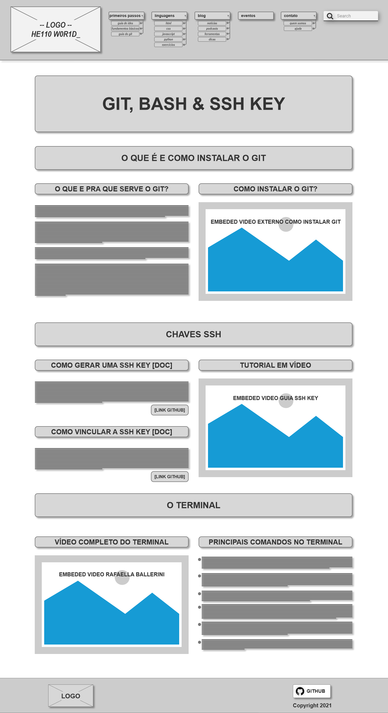
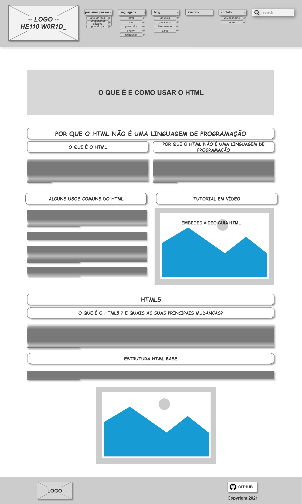
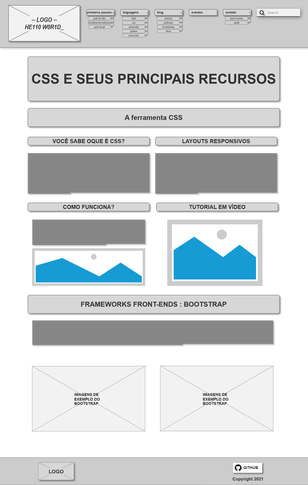
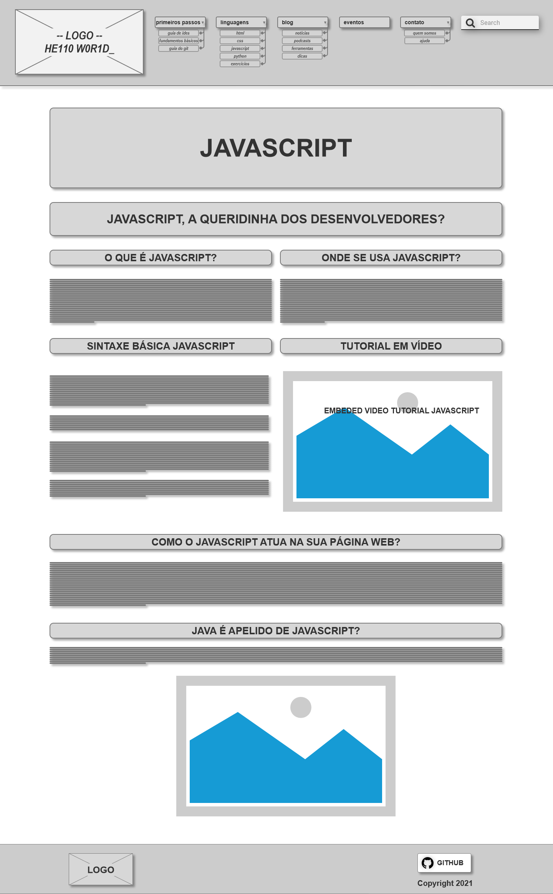
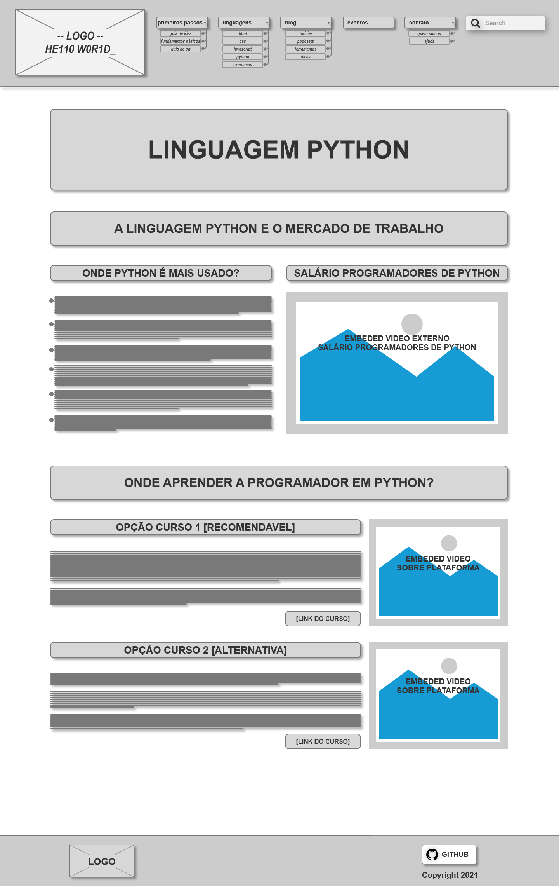
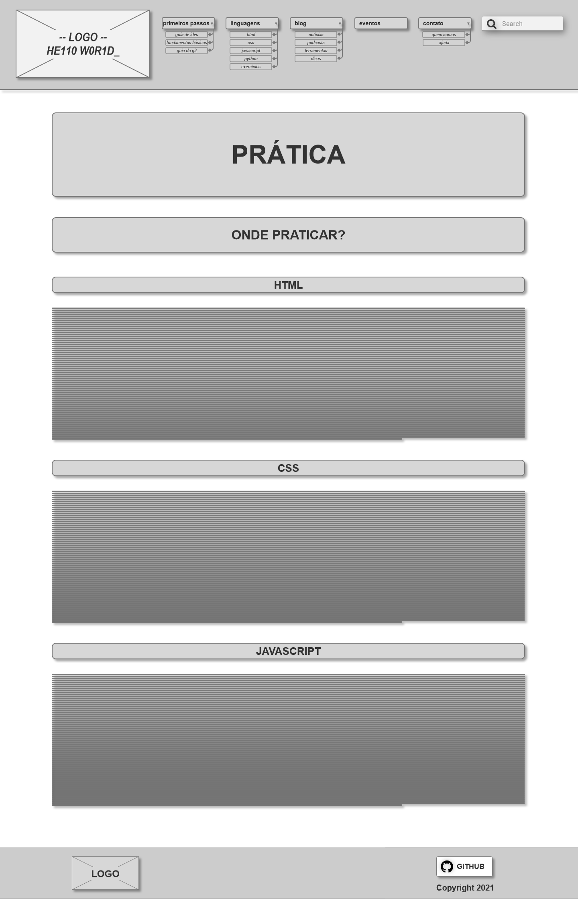
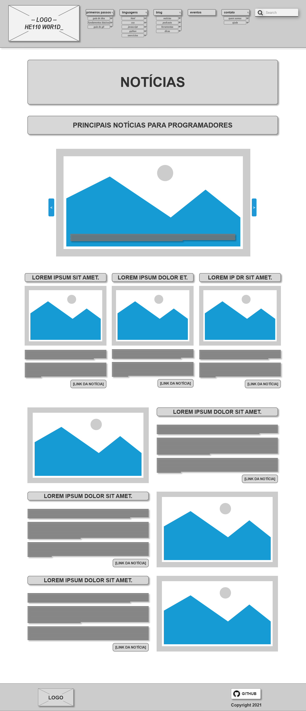
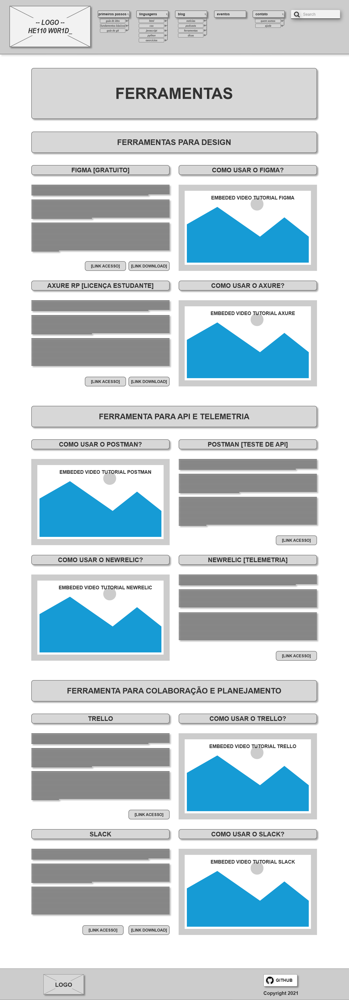
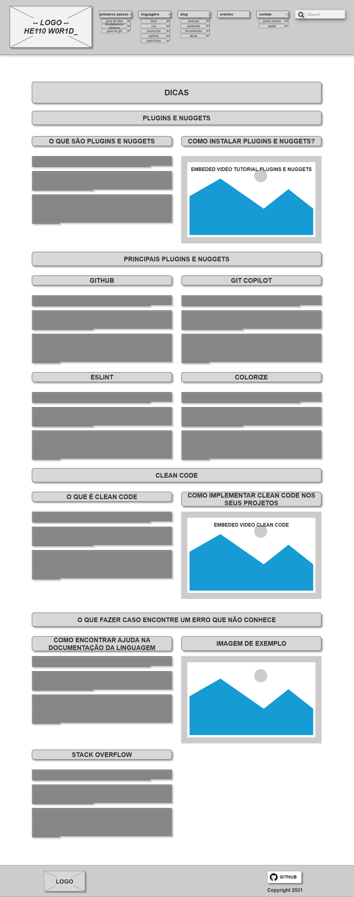
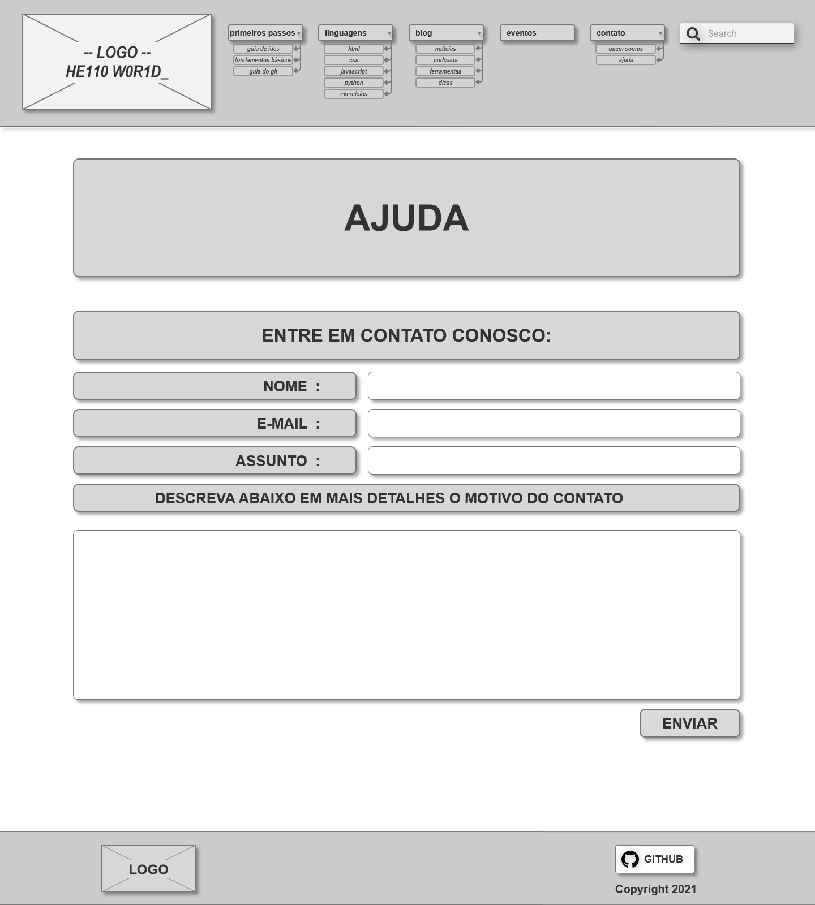

# Projeto de Interface

O projeto está dividido em 5 menus principais: Primeiros Passos, Linguagens, Blog, Eventos e Contato seguido de seus sub-menus. As informações foram organizadas para proporcionar um acesso simples e direto, com o foco na usabilidade e facilidade de navegação. O usuário pode fazer uso da barra de navegação em todas as páginas para retornar a página inicial ou acessar o conteúdo disponível pelo menu.

## User Flow

## Wireframes

### Homepage

A home page é composta por um texto que explica o objetivo do site e oque o usuário irá encontrar pela frente. Em seguida, é apresentado botoes, posicionados em sentido de " escada no sentindo descendo " para que o usuario entenda por onde começar. Ao clicar, o usuario terá acesso ao conteudo de forma sequencial ou individual se clicar no menu e escolher a página que deseja entrar. Logo abaixo o usuário encontra uma apresentaçao sobre o informaçoes gerais do projeto e equipe. Por fim, um box de notícias relevantes que estão atreladas ao mundo da programaçao.

[homepade-wireframe](img/homepage.png)

### Primeiros Passos: Guia de IDEs

Ao clicar no botão "Primeiros Passos" na página inicial, o usuário poderá selecionar entre 3 opções sendo "Guia de IDEs" um deles, que apresentará para o usuário a página abaixo com os principais editores de código disponíveis, tal como uma menção bônus do WebStorm (IDE dedicado para Frontend feito pela JetBrains. No final da página contém um vídeo comparando os editores mencionados.

### Primeiros Passos: Fundamentos para aprender a programar

Ao clicar no botão "Primeiros Passos" na página inicial, o usuário poderá selecionar a opção "Fundamentos para aprender a programar" que irá navegá-lo para a página abaixo, nela o usuário encontra informações sobre fundamentos desejáveis para uma pessoa que deseja se um programar. Com explicações sobre a importância dos fundamentos matemáticos, assim como fontes externas de como se atualizar sobre. Além de uma área voltada para lógica de programação, acompanhada por um exemplo de código simples, com seu pseudocódigo e por fim um fluxograma representando seu funcionamento, mostrando assim para o usuário algumas das diferentes representações de uma lógica, além do código propriamente dito.

### Primeiros Passos: Guia do Git

Ao clicar no botão "Primeiros Passos" na página inicial, o usuário poderá selecionar a opção "Guia do Git" que irá navegá-lo para a página abaixo, nela o usuário encontra informações sobre a utilidade e instalação do git. Chaves SSH e links para a documentação no github ensinando o necessário e um vídeo sobre o mesmo assunto. Por fim um vídeo para personalização do perfil do github como bônus e os principais comandos utilizados no fluxo de trabalho com git.

### Linguagens: HTML

Ao clicar no botão "Linguagens" na página inicial, o usuário será direcionado para um sub menu onde poderá escolher a opção HTML.
Na página ele encontrará uma breve introdução sobre o HTML, o motivo de não ser consderado uma lingugem de programação, usos comuns para os quais ela se aplica,as novidades que o HTML5 trás consigo e sua estrutura base,

### Linguagens: CSS

Ao clicar diretamente no botão " CSS " ou se seguir a sequencia do conteúdo de linguagens, o usuário terá acesso ao conteudo destinado para a explicaçao sobre CSS. A página é composta por explicações sobre oque é CSS, como funciona, layuots responsivos , tutorial em video e por ultimo uma explicação sobre o bootstrap seguido de imagens que retratam seus componentes de uso.

### Linguagens: JavaScript

%DESCRIÇÃO%

Ao clicar no botão "Linguagens" na página inicial, o usuário será direcionado para um sub menu onde poderá escolher a opção JavaScript. Na página ele encontrará uma breve introdução sobre a linguagem, onde se usa-lá, a sintaxe básica, como a linguagem atua no ambiente web, a difernça entre Java e JavaScript e por fim será apresentado em vídeo uma explicação mais detalhada dos tópicos anteriormente citados.
  

### Linguagens: Python

Detrno do botão de "Linguagens" pela opção "Python" o usuário terá esta página com inforamções sobre a lingugem e seu mercado de trabalho e opções de curso para aprender a programar em python.

### Linguagens: Exercícios

Ao clicar no botão "Linguagens" na página inicial, o usuário será direcionado para um sub menu onde poderá escolher a opção exercícios. Na página ele encontrará os exercícios separados por linguagens e com links externos que o permitirão colocar em ação aquilo que foi aprendido. Os links levarão o usuário a exercícios para inicantes e também à plataformas que permitirão ao ulitizador salvar seu progresso e ver seu desenvolvimento na linguagem de sua preferência.

### Blog: Notícias

Na página inicial o usuário consegue acessar a página "Nóticias" ao clicar no botão "Blog", ela apresenta um carrossel com links externos para notícias, cards e postagens com links externos.

### Blog: Podcasts

Ao clicar no botão "Blog" na página inicial, o usuário poderá selecionar a opção "Podcasts", em um sub menu, que irá direciona-lo para a página abaixo. Nela o usuário encontrará podcasts com informações sobre tecnologia, sobre o dia a dia de pessoas que trabalham na área da tecnologia e  dicas e notícias para se manterem atualizados.A página contará com diversos podcasts, onde serão destacados os dez mais interessantes, fazendo-se um breve descrição dos assuntos abordados em cada podcasts, e os demais, não menos interessantes, virão com seu link ao final da página.     

### Blog: Ferramentas para Desenvolvedores

O usuário encontrará a opção "Ferramentas para Desenvolvedores" ao clicar no botão "Blog" na página inicial, essa página consiste em um agregado de ferramentas úteis para facilitar o trabalho do desenvolvedor em diversas áreas, feitas em postagens explicando brevemente em texto uma ferramenta específica e um vídeo ao lado falando sobre ela, como usar ou dicas para otimizar o uso dela.

### Blog: Dicas

Ao clicar no botão a opção "Dicas" ao clicar no botão "Blog" que irá navegá-lo para a página abaixo, que consiste em informações e ferramentas que podem fazer a vida do programador mais simples, como plugins e nuggets, o princípio do clean code, uma prática que facilita no momento de manutenções e revisões no código e por fim algumas dicas de como o programador procurar por soluções para erros encontrados.

### Eventos Lista

Ao clicar no botão eventos no menu principal, o usuário será encaminhado para uma pagina onde terá acesso a uma lista com todos os eventos disponíveis. Nessa pagina, poderá filtrar os eventos por categoria (online e / ou presencial) e / ou ordenar por data ( de mais recentes para mais antigos /  de mais antigos para mais recentes). Ao clicar no video ou foto do evento, o usuário será encaminhado para uma pagina de detalhes onde terá acesso a mais informações sobre aquele evento.

### Eventos Detalhe

Ao clicar em uma foto ou video na pagina de Eventos - Lista, o usuário será encaminhado para a pagina de detalhes do evento selecionado. Nessa pagina, o usuário verá uma descrição sobre o evento com todos os detalhes. Se for um evento presencial, ele terá, também, acesso a hora, data e endereço e terá acesso ao link que o encaminhará para comprar ingressos ou se inscrever gratuitamente para participar. Se for um evento online, além da descrição o usuário poderá assistir ao video diretamente da pagina de detalhes.

### Contato: Quem Somos

A página destinada a " Quem somos" apresenta ao usuário um breve texto que conta sobre a formaçao do projeto e também as informaçoes da equipe. Além disso, ao final, é apresentado blocos com os nomes de cada membro da equipe bem como o seu github para que o usuario possa conhecer nao somente quem criou o projeto mas também saber mais sobre outros projetos criados pelos mesmos.

### Contato: Ajuda

Ao clicar no botão "Contato" seguido da opção "Ajuda" presente na página inicial, é apresentado um formulário simples de Nome, Email, Assunto e Descrição para que o usuário envie um pedido de suporte.

 

<a href="./especification.md">Especificações</a>
